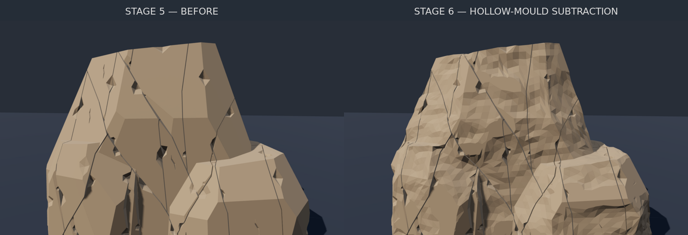

# Stage 6 — noisy hollow-mould prototype

**Current default:** [Auto procedural influence, with Paint and Auto + paint options](AUTO_DETAIL.md).

**Update:** [Painted influence masks, new patterns, coverage and independent depth](PAINTED_DETAIL.md) are now available. The measurements below document the original unmasked prototype.

The rejected texture/banding pass was reverted first (`d86d187`, reverting `593f74f`). The accepted spline and transformation tools remain. No RC/atrium, particle simulation, or stages 1–5 geometry-source code was changed.

## Construction

`Stage 6 = Stage 5 − noisy(Box − original Stage 1)`

1. Put the **original stage-1 mass**, not the fractured stage-5 rock, inside a larger box.
2. Subtract the original mass from that box. This makes a closed negative mould.
3. Remove redundant coplanar tessellation and linearly subdivide the mould's triangles.
4. Displace the **inner** wall along area-weighted vertex normals using signed, seeded, three-octave 3D value noise. Keep the outer box fixed. Fade displacement smoothly to zero at ground level.
5. Subtract the displaced mould from stage 5 using **Manifold 3.5.4 triangle-mesh CSG**.

Pushing part of the mould into the rock cuts a hollow. Pulling it away leaves the existing rock there; it cannot grow new rock. Existing fracture voids are therefore not filled by the boolean. No SDF, voxels, height-field replacement, texture maps or material bands are used.

## Controls and inspection

Select **06 · Mould detail**, then **Rebuild through 06**. Detail changes reuse stages 1–5. Placement-only edits reuse all geometry. Changing upstream geometry invalidates the detail cache.

- **Triangle spacing:** 0.65 m default; smaller makes more triangles. This is a deliberately coarse prototype, not millimetre-scale rock grain.
- **Noise displacement:** 0.5 m default maximum noise contribution, not a guaranteed cut depth.
- **Mean inward cut:** 0.08 m default bias.
- **Wavelength / vertical frequency / noise seed:** control the signed 3D signal.
- Set both displacement and mean cut to zero for a neutral control, within numeric cleanup precision.
- Switch between final rock, before-detail rock, original base, raw hollow mould and noisy mould. The mould views use a display-only, uncapped section plane; the actual mould remains closed. Inspection lighting disables mould self-shadowing so the cavity is readable.
- OBJ export **always exports the final selected geological stage**, never the inspection cutter. Placement is applied. Version-9 recipes save the detail settings; older recipes remain readable.

The prototype caps the subdivided mould at 220,000 triangles and also rejects an excessive conservative preflight estimate. Increase spacing if the budget is exceeded.

## Actual renders

These PNGs are captured from the application's live Three.js canvas, not generated illustrations. A uniform warm clay colour was used to expose the geometry; there are **no textures**. The exact recipe and browser measurements are stored alongside the images.

- [Final rock](mould-renders/stage6-final.png)
- [Close view](mould-renders/stage6-close.png)
- [Before detail](mould-renders/stage5-before-close.png)
- [Noisy mould cutaway](mould-renders/noisy-mould-cutaway.png)
- [Recipe](mould-renders/recipe.json)
- [Browser measurements](mould-renders/measurements.json)

Captured headland: **21,506 output triangles**, 35,192 subdivided mould triangles, 6,026 inner-wall vertices processed. Signed offsets were approximately **−0.269 to +0.465 m**. Rock volume fell from **4,509.297 to 4,398.241 m³**. The measured browser **detail computation** was **1.35 seconds** in the sandbox; this excludes stages 1–5, initial WASM loading and viewport rendering. It is not a user-hardware FPS claim.

## Validation and numerical exchange

Manifold computes in double precision but its mesh exchange uses Float32. Microscopic output slivers can become collinear when rounded. The implementation retries bounded 1–3 mm kernel simplification with Float32 reimport, then, only if needed, repairs degenerate exchange corners with a link-safe microscopic edge collapse or collinear diagonal flip (10 micrometre bound). It never simply deletes a bad face and leaves a hole. Final topology and triangle area are checked again; failures reject the result and disable export.

`npm run test:mould-detail` passed headland (two seeds and a neutral control), wide wall, arch, canyon, spire and route-cliff fixtures. It checks open/nonmanifold edges, nonmanifold vertices, winding, duplicate/degenerate faces, positive volume, unchanged upstream meshes, cache invalidation, placement reuse, recipe round-trip and the result-minus-stage-5 residual.

Because of numerical simplification, subtraction is not an exact mathematical subset at arbitrarily tiny scales. Measured excess outside stage 5 was **0.00025–0.01788 m³** across the tested fixtures (the largest result was the canyon, whose input volume exceeded 9,200 m³). No macroscopic added-rock construction is performed. The neutral control changed total volume by approximately 0.057 m³ out of 4,509 m³. Node and browser results can differ by a few triangles near numeric tolerances.

`npm run test:mould-detail:browser` passed production-bundle/WASM loading, six-stage UI, inspection clipping, final-only OBJ export, detail-only cache rebuild and no page/resource errors. The existing viewport test also passed actual move/rotate/scale drags, posed spline dragging, point editing and posed OBJ/recipe export. Placement and particle CPU tests passed.

## Deliberate prototype limitations

- This is **faceted, low-resolution relief**, not a claim to reproduce the reference's fine geological detail.
- Narrow triangles remain at boolean intersections and are counted in the UI. Closed topology is **not** a proof that every possible noisy warp is globally self-intersection-free.
- Stage 6 currently emits one combined mesh object, potentially containing several disconnected rock pieces. Face-origin tags and per-block selection are consolidated; explode view is disabled for stage 6. Source spall/fissure counts are labelled as upstream counts, not a recount after carving.
- The accepted nine base formations and their editing tools remain; six formations were exercised through the full detail pipeline, not every possible parameter combination.
- Particle stacking, fine-grain rendering and geological noise art direction remain separate work.

Manifold is distributed under Apache-2.0. Its license is included in `public/licenses/manifold-3d-LICENSE.txt` and copied into the published site.
